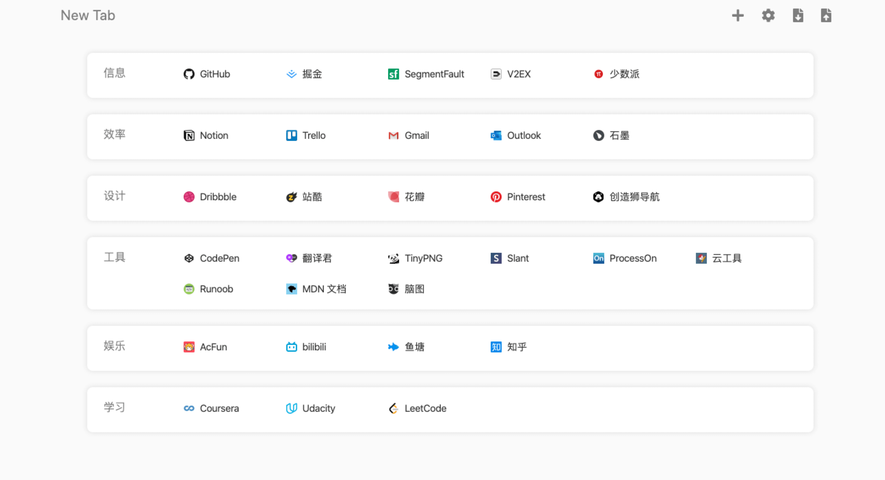
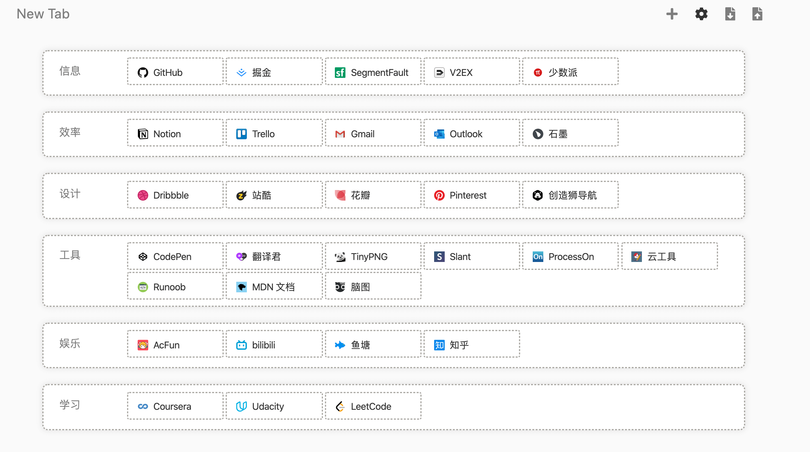
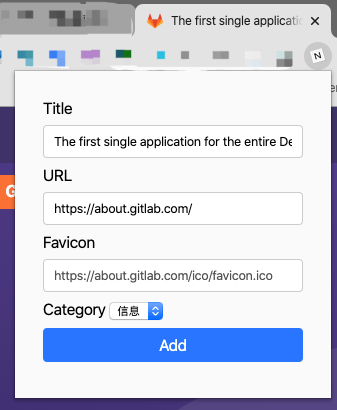

<br />
<p align="center">
  <a href="https://github.com/CharAct3/nav-new-tab">
    
  </a>
</p>

<h3 align="center">Nav New Tab</h3>
<p align="center">
  <a href="https://github.com/charact3/nav-new-tab/actions">
    
  </a>
</p>

<p align="center">
  Navigation page in Chrome new tab.
  <br />
  <br />
  <a href="https://chrome.google.com/webstore/detail/nav-new-tab/aeplejakcfkdbifdebfoblpakgmjclph">View in Webstore</a>
  ·
  <a href="https://github.com/CharAct3/nav-new-tab/issues">Report Bug</a>
</p>

---

### Built With

- React-Bootstrap
- Mobx

## Features

<p align="center">
  
</p>
  
### Edit your ingresses.
<p align="center">
  
</p>

### Add new ingresses via menu bar button.
<p align="center">
  
</p>

## Develop

```bash
git clone https://github.com/CharAct3/nav-new-tab
cd nav-new-tab
yarn install
```
